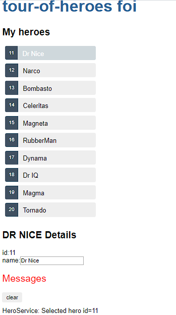

# Tour of heroes

The `first project` of this initial studies was developed following angular docs sugested application in [angular docs](https://angular.io/tutorial)

## Topic 1 - Hero editor
<details>
  <summary>Concepts</summary>
  <ul>
    <li>Create a component</li>
    <li>interpolation</li>
    <li>pipe</li>
    <li>two-way binding</li>
  </ul>
</details>

It was created `Heroes component` (ng generate component <name>) and used concepts like `interpolation` to display heros info from a `interface` with id and name. Furthermore it was used `pipe` to upercase hero name and `two-way` binding in an input to change the hero's name, FormsModule was required to use `ngModel` as a input's property

### Code sample review

```HTML
<!-- interpolation and component  -->
<h1>{{title}}</h1>
<app-heroes></app-heroes>

<!-- pipe -->
<h2>{{hero.name | uppercase}} Details</h2>

<!-- two-way binding -->
<div>
  <label>name:
    <input [(ngModel)]="hero.name" placeholder="name"/>
  </label>
</div>
```


## Topic 2 - display a list
<details>
  <summary>Concepts</summary>
  <ul>
    <li>Directives: *ngFor, *ngIf</li>
    <li>Event binding</li>
    <li>Class binding</li>
  </ul>
</details>

A list of heroes was created and displayed with `Directive *ngFor`, to give interactivity to the list `event binding (click)` was used, finaly the `directive *ngIf` was used to show the details only when the hero was clicked in list and `class binding` styled selected hero.
### Code sample review

```HTML
<!-- List of heroes using ngFor, class binding to see selected hero and event binding to show hero detail-->
<li *ngFor="let hero of heroes"
  [class.selected]="hero === selectedHero"
  (click)="onSelect(hero)">
  <span class="badge">{{hero.id}}</span> {{hero.name}}
</li>

<!-- ngIf to see hero only one is selected -->
<div *ngIf="selectedHero">
  <h2>{{selectedHero.name | uppercase}} Details</h2>
  <div><span>id: </span>{{selectedHero.id}}</div>
  <div>
    <label>name:
      <input [(ngModel)]="selectedHero.name" placeholder="name"/>
    </label>
  </div>
</div>
```

## Topic 3 - Create a feature component
<details>
  <summary>Concepts</summary>
  <ul>
    <li>Disengage features break two components</li>
    <li>Data flow between parent and child component</li>
  </ul>
</details>


A hero detail component was created  to disengage details from heroes component. To do so, `@Input decorator` was used to allow `property binding` wich is responsable to flow data from a parten component to a child component

### Code sample review

```HTML
<!-- Father component -->
<app-hero-detail [hero]="selectedHero"></app-hero-detail>

<!-- Child component -->
<div *ngIf="hero">

  <h2>{{hero.name | uppercase}} Details</h2>
  <div><span>id: </span>{{hero.id}}</div>
  <div>
    <label>name:
      <input [(ngModel)]="hero.name" placeholder="name"/>
    </label>
  </div>

</div>
```

```typescript
@Input() hero: Hero;
```

## Topic 4 - Add services
<details>
  <summary>Concepts</summary>
  <ul>
    <li>Services, consuming and providing</li>
    <li>Synchronously and Asynchronously communication</li>
  </ul>
</details>

Hero service was created to simulate fetching data from a server, with that concepts as  `Synchronously` and `Asynchronously` communication was introducted. It also was presented `@Injectble()` to do the Dependency injection and the `Provider` terms. It was also created a `messageService`.

### Code sample review

```HTML
<!-- Message component -->
<div *ngIf="messageService.messages.length">

  <h2>Messages</h2>
  <button class="clear"
          (click)="messageService.clear()">clear</button>
  <div *ngFor='let message of messageService.messages'> {{message}} </div>

</div>
```

```typescript
  //injecting the service trought DI
  constructor(private heroService: HeroService, private messageService: MessageService) { }

  // Using the function provided by the HeroService in heroComponent
  getHeroes(): void {
    this.heroService.getHeroes()
        .subscribe(heroes => this.heroes = heroes);
  }

  // Fetch data by a observable
  getHeroes(): Observable<Hero[]> {
    // TODO: send the message _after_ fetching the heroes
    this.messageService.add('HeroService: fetched heroes');
    return of(HEROES);
  }
```
### An image of the application until now


## Topic 5 - Add services
<details>
  <summary>Concepts</summary>
  <ul>
    <li>Routing</li>
    <ul>
      <li><router-outlet></router-outlet></li>
      <li><a routerLink="/heroes">Heroes</a></li>
      <li>{ path: 'dashboard', component: DashboardComponent },</li>
      <li>private route: ActivatedRoute</li>
      <li>private heroService: HeroService</li>
      <li>private location: Location</li>
    </ul>
    <li>Dashboard</li>
  </ul>
</details>

A new component `Dashborad` was created to use `Routes`. Routes with id has been made to each hero detail using `{ path: 'detail/:id', component: HeroDetailComponent }` in app-routes.module.ts and `routerLink="/detail/{{hero.id}}">` in the template. In the component class a function was created to get the id using `const id = +this.route.snapshot.paramMap.get('id');`. After this work, no changes in the template is required.

### Code sample review
```typescript
  //injecting the service trought DI
  constructor(
    private route: ActivatedRoute,
    private heroService: HeroService,
    private location: Location
  ) {}


  //The route.snapshot is a static image of the route information shortly after the component was created.
  // The paramMap is a dictionary of route parameter values extracted from the URL. The "id" key returns the id of the hero to fetch.
  // Route parameters are always strings. The JavaScript (+) operator converts the string to a number, which is what a hero id should be.
  getHero(): void {
  const id = +this.route.snapshot.paramMap.get('id');
  this.heroService.getHero(id)
    .subscribe(hero => this.hero = hero);
  }

  //Routes module
  const routes: Routes = [
  { path: '', redirectTo: '/dashboard', pathMatch: 'full' },
  { path: 'dashboard', component: DashboardComponent },
  { path: 'detail/:id', component: HeroDetailComponent },
  { path: 'heroes', component: HeroesComponent }
];

```
